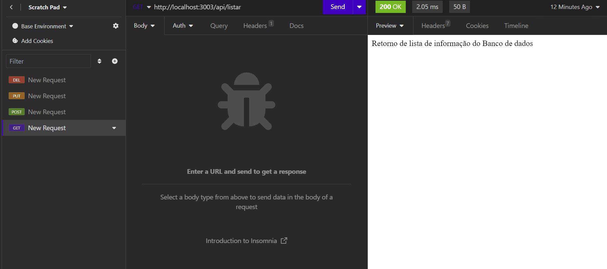
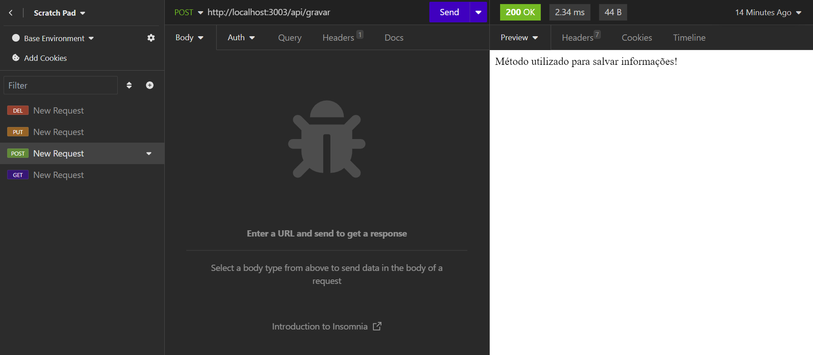
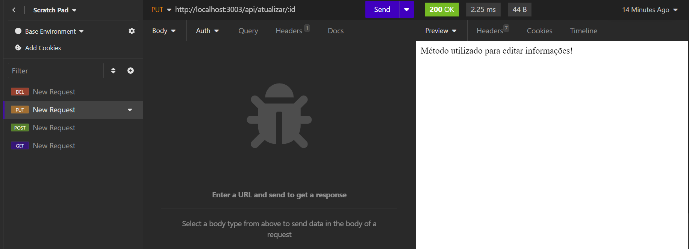
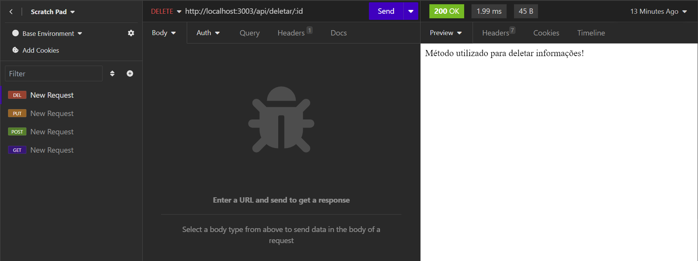

# Testar rotas da API com o Insomnia
* Copiar url do projeto no gitHub
* Abrir o gitBash

**Clonar o repositório para sua máquina**
```
git clone URL_REPOSITORIO
```

**Acessar pasta**
```
cd NOME_REPOSITORIO
```

**Reinstalar os pacotes**
```
npm i
```
**Recriar o arquivo .env**
* Definir as variáveis no arquivo .env a partir das chaves definidas no arquivo .env.example
```
PORT = 3000
```
**Criar pasta controllers na pasta src**
```
mkdir src/controllers
```

**Criar arquivo crudController.js na pasta controllers**
```
touch src/controllers/crudController.js
```

**Colar os códigos no arquivo crudController.js**
```
function listarDados(request, response) {
    response.send('Retorno de lista de informação do Banco de dados');
}

function gravarDados(request, response) {
    response.send('Método utilizado para salvar informações!');
}

function atualizarDados(request, response) {
    response.send('Método utilizado para editar informações!');
}

function deletarDados(request, response) {
    response.send('Método utilizado para deletar informações!');
}

module.exports = {
    listarDados,
    gravarDados, 
    atualizarDados, 
    deletarDados
}
```

**Alterar o arquivo rotas.js**
```
// Importar pacote do express
const { Router } = require('express');
// Instanciar o Router na variavel router
const router = Router();
// Importar funções do controller para a rota acessar as funções
const { 
    listarDados,
    gravarDados,
    atualizarDados,
    deletarDados
 } = require('../controllers/crudController');

router.get('/listar', listarDados);

router.post('/gravar', gravarDados);

router.put('/atualizar/:id', atualizarDados);

router.delete('/deletar/:id', deletarDados);

module.exports = router;
```

**Testar os endpoints (rotas) da API:**

## Insomnia

* Abrir o Insomnia no computador

* Criar um novo projeto, clicando no símbolo de '+'

* Dar um nome ao projeto e clicar no botão 'Create'

* Com o projeto criado, clicar no botão 'New Collection'

* Dar um nome para a coleção e clicar no botão 'Create'

* Criar a primeira requisição para a API clicando no botão 'New HTTP Request'

* Todas as requisições desta coleção ficam listadas no quadro da esquerda

* Por padrão a requisição é criada no método GET, mas podemos alterar o método da requisição clicando no ícone de seta para baixo ao lado do nome 'GET'

* Descrever a url da API com a porta que foi definida
```
http://localhost:3000
```

* e as rotas (/api/listar) que criamos no arquivo rotas.js do passo anterior. Ficará assim:
```
http://localhost:3000/api/listar
```
* Antes de clicar no botão 'Send' para executar a ação da rota, execute o comando 'npm start' no gitBash e  verifique se o retorno estará rodando na porta definida para o servidor

* Exemplo:

```
'Running on port 3000!'
```

* Após validar que a API esta rodando, execute a ação da rota clicando no botão 'Send'

* O Insomnia deverá  validar os conteúdos de cada rota retornados pelas funções do 'crudController'

### Método GET


## Fazer o mesmo processo com os próximos métodos (POST, PUT e DELETE)

### Método POST


### Método PUT


### Método DELETE


**Enviar os arquivos atualizados para o gitHub**